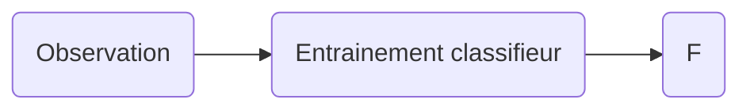

# Analyse, classification et indexation des données

[TOC]

[Lien mémo matlab](http://robin.navarro.emi.u-bordeaux.fr/MatLab.html)

## Classification des données

* Système numérique (capteur + unité de calcul)

* Comment traiter les données

  Algorithme $\longleftrightarrow$ modèle { capture la prise de décision

L'intégration de connaissances dans un modèle fait appel à ce que l'on appel l'apprentissage. Il y a différents types d'apprentissage :

* Supervisé

* Non-supervisé

* Semi-supervisé

  

#### Apprentissage Supervisé

On possède un ensemble de données annotée. C'est ce qu'on appel des *Vérité terrain*.

`Obs = {(data 1, class 1), (data 2, class 1), (data 3, class 2)}`

Soit :
$$
Obs = \left\{
(x, y), 
\begin{array}{ll}
x \in \mathbb{R}\\
y \in \left\{ class\ 1,\ class\ 2,\ ...,\ class\ n\right\}
\end{array}
\right\}
$$

#### Apprentissage Non-Supervisé

Pour l'apprentissage non-supervisé, nous ne possédons pas de vérités terrain.

Nous possédons seulement $\left\{ x \in \mathbb{R} \right\}$ + nombre de classes.

#### Apprentissage semi-supervisé

Ce type d'apprentissage est un mélange des deux précédents. Nous possédons des vérités terrains, que l'on veut *propager* pour d'autres valeurs

Autrement dit, nous possédons par exemple $\left\{(x_{1},\ c_{1}),\ (x_{2},\ c_{2}),\ ...,\ (x_{n}, \ c_{2})  \right\}$ et nous voulons trouver les classes pour $x_{n+1},\ x_{n+2},\ x_{n+3}$.

Nous avons donc des *features*, ou *descripteur* $\in \mathbb{R}^n$,  et des classes, qui sont des données discrète $\in \mathbb{N}$ ou des `String`.

Une *Observation* est un ensemble de couple descripteur/classe.

### Exemple

Prenons pour exemple une usine de tri de poisson. Nous voulons séparer de manière automatique les bars des saumons. Nous avons donc deux classes, {"Bar", "Saumon"}. Il nous faut maintenant choisir les descripteurs. Nous pouvons par exemple choisir le poids et l'apparence.

Si les bars et les saumons ont la même distribution du descripteur poids, alors ce descripteur n'est pas *discriminant*.

### Régression linéaire

Observation : $ \left\{ \begin{array}{ll} Features \in \mathbb{R^n}\\ classes \in \mathbb{\mathbb{N}, ou\ \mathbb{R}}\end{array}\right. $ 	*m* est égale au nombre de couples dans l'observation. *n* représente la dimension du descripteur. 

$F: \mathbb{R^n} \rightarrow \mathbb{R}\\\ \ \ \ \ \ \ \ \ x \rightarrow y$	 *Quel information sur F ?*  Il faut faire un a priori sur la fonction F. Ici, on considère que F est une fonction linéaire (droite, plan, ..., hyperplan). C'est donc une droite de la forme $ax + b, \left. \begin{array}{ll} a \in \mathbb{R^n}\\b \in \mathbb{R^n}\end{array}\right\}$. $a$ est un vecteur ligne et $b$ est un vecteur colonne. Passage de l'un à l'autre avec une *transposé*.

$F: \theta_{1} \vec{x} + \theta_{0}$, $\theta_{1}$ n'est pas le vecteur directeur, mais le vecteur normal, car passage en dimension $n$. On cherche $\theta_{1}$ et $\theta_{0}$. On va les fusionner en un vecteur, $F: \theta \vec{x}$.

*Comment passer de $\vec{x}$ a $\vec{\tilde{x}}$ ?* On ajoute une colonne de 1 au début. 

$\theta$ devient $ \begin{pmatrix}\theta_{0}\\\theta_{1}\end{pmatrix} $ et $\tilde{x}$ $\begin{pmatrix}1\\x\end{pmatrix}$. 

On doit tenir compte de l'observation pour calculer $\theta$ : $ F(x_{i}) \rightarrow y_{i} $. Nous avons $m$ descripteurs. Si $x \in \mathbb{R^n}, \theta \in \mathbb{R^{n+1}}$. On calcule donc *l'erreur quadratique moyenne* :
$$
J(\theta) = \Sigma_{i = 1}^{m}(F(x_{i}) - y_{i})^2
$$
On cherche donc à minimiser $J(\theta)$.

#### Récapitulatif

1. Observation = {(features, observé)}
2. Forme de la fonction (hyperplan)
$$
   \begin{array}{lll} \theta_{0},\ \theta_{1} \rightarrow \theta(\theta_{0},\ \theta_{1})\\x \rightarrow \tilde{x} \end{array}
$$
1. On définit $J(\theta)$, fonction à minimiser.
2. On cherche une solution approximative.*

#### Minimalisation d'une fonction

On utilise des *dérivé partielle* : $\frac{\partial (F(\theta))}{\partial (\theta_0)}$ et $\frac{\partial (F(\theta))}{\partial (\theta_1)}$. Le vecteur $ \begin{pmatrix}\frac{\partial (F(\theta))}{\partial (\theta_0)} \\ \frac{\partial (F(\theta))}{\partial (\theta_1)}\end{pmatrix} \rightarrow \underbrace{\vec{\nabla}F(\theta_0)}_{Le\ gradient} = \begin{pmatrix}x_0\\x_1\end{pmatrix}$ (pas sur de ce résultat). On calcul le gradient de $J$ et on cherche $\theta$ tel que $\vec{\nabla}J(\theta) = \vec{0}$.

$$
J(\theta) = \Sigma_{i = 1}^m(F(x_i)-y_i)^2 = \Sigma_{i = 1}^m(\vec\theta\tilde{x} -y_i)^2
$$
On doit résoudre : $\begin{pmatrix}\frac{\partial (F(\theta))}{\partial (\theta_0)} \\ \frac{\partial (F(\theta))}{\partial (\theta_1)}\end{pmatrix} = \begin{pmatrix} 0\\0\end{pmatrix}$.

Deux possibilités :

* Solution analytique (pas toujours possible)
* Solution algorithmique ( = descente de gradient). **Attention** Ne marche pas toujours très bien !

Idée : Aller dans le sens de la pente (descente). On regarde le résultat de la dérivée :

* < 0 : On avance
* \> 0 : On recule

$\theta^{n+1} = \theta^n - \vec\nabla J(\theta^n)$. On s'arrête lorsque $||J(\theta^{n + 1})||\less \epsilon$. Rien ne garantit que le minimum local sera atteint.

$\theta^{n + 1} = \theta^n - \eta(n)\vec\nabla J(\theta^n)$, ou $\eta$ est un coefficient d'accélération/amortissement.

Si nous avons un échantillon de $10^6$, on restreint le gradient à une partie de l'observation.

### Rappel : Schéma général descente de gradient

$J(\theta)$

* J fonction objective
* $\theta$ variable

Il nous faut trouver $\theta$ tel que $J(\theta)$ soit minimal. Pour cela, on utilise un processus itératif :
$$
while((\theta_{k + 1} - \theta_k) \ge \epsilon) \\
\hspace{4cm}	\theta_{k + 1} = \theta_k - \eta(k)\vec\nabla J(\theta_k)\\
$$
$\vec \nabla J(\theta) = \begin{pmatrix} \frac{\partial(J(\theta))}{\partial(\theta_0)}\\.\\.\\.\\\frac{\partial(J(\theta))}{\partial(\theta_n)}\end{pmatrix}$ *Espace de dimension n, + 1 avec $\theta_0$*. Avant le processus itératif, il faut initialiser la déscente en choisissant $\theta_0$. Soit au hasard, soit en ayant une idée de la forme de la courbe.

#### Régression Linéaire

Informations : 

* Observation: `{..., (xi, yi), ...}`
* Forme générale de la fonction, on cherche une fonction de la forme $h(x)=\theta x + \theta_0$.

Pour simplifier les calculs, nous allons utiliser $\tilde \theta = \begin{pmatrix}\theta_0\\.\\.\\.\\\theta_i\end{pmatrix},\ x \rightarrow \tilde x = \begin{pmatrix}1\\.\\.\\.\\x_i\end{pmatrix}$. Nous obtenons alors $h(\tilde x) = \tilde \theta \tilde x$. La fonction d'erreur devient $J(\tilde \theta) = \Sigma_{i = 1}^m(\tilde \theta \tilde x_i - y_i)^2$.

$\frac{\partial J(\tilde \theta)}{\partial \tilde \theta_i} = 2 * \Sigma_{i = 1}^mx_i^k(\tilde \theta \tilde x_i - y_i)$ Commen on cherche une minimalisation, on peut ignore le facteur constant *2*.

Nous obtenons : $\vec \nabla J (\tilde \theta) = \begin{pmatrix} \Sigma_{i=1}^mx_1^0(\tilde \theta \tilde x_i - y_i)\\.\\.\\.\\\Sigma_{i = 1}^mx_i^k(\tilde \theta \tilde x_i - y_i) \end{pmatrix} $

### Reformulation du problème

Prenons $Obs = \{((2, 3), 1),\ ((4, 5), 3), ((5, 4), 8)\}$. 

$$
X = \begin{bmatrix}1 & 2 & 3\\1&4&5\\1&5&4\end{bmatrix},\ \vec y = \begin{pmatrix}1\\3\\8\end{pmatrix},\ \tilde \theta = \begin{pmatrix} \theta_0\\\theta_1\\\theta_2\end{pmatrix} \rightarrow J(\tilde \theta) = \underbrace{(X \tilde \theta - \vec y)^T(X \tilde \theta - \vec y)}_{\in \mathbb{R}}
$$

$\frac{\partial(J(\tilde \theta))}{\partial(\tilde \theta)} = \frac{\partial((X \tilde \theta)^TX \tilde \theta - (X \tilde \theta)^T \vec y - \vec y^T X \tilde \theta+ \vec y^T \vec y )}{\partial( \tilde \theta )} = \frac{\partial((X \tilde \theta)^T X \tilde \theta - 2 \vec y (X \tilde \theta ))}{\partial(\tilde \theta)} = \underbrace{XX^T}_{carré}\tilde \theta - X^T \vec y$ 

$\frac{\partial (J(\tilde \theta))}{\partial(\tilde \theta)} = 0 \leftrightarrow XX^T \tilde \theta = X^T \vec y$. Si $XX^T$ est inversible, alors on peut calculer $(XX^T)^{-1}$. La solution est $\tilde \theta = (XX^T)^{-1}X^T \vec y = y\backslash X$. 

Est-ce que $X \tilde \theta - \vec y = \vec 0$ ? Non, il n'y a pas de solution exacte.

## Approche baysienne

Idée principale : On connait la forme de la distribution, on ne donne pas les paramètres, mais on connait la loi de probabilité.

### Problèmes à 2 classes

Classes = $\{w_1, w_2\}$, Vérité terrain = {{F1, "Bar"}, ...}. Il faut prendre un décision en fonction de la vérité terrain.

#### Maximum à priori

VT = $\{(\empty, "bar"),(\empty, "saumon"),...,(\empty, "bar")\}$. Les informations que nous avons sont le nombre de bar et le nombre de saumon. $P(bar) = \frac{nbBar}{|V.T|}$ et $P(saumon) = \frac{nbSaumon}{|V.T|}$. Pour vérifier, on regarde si la somme des deux est égale à 1. Ici c'est le cas.

Pour le maximum à priori, nous obtenons le classifieur suivant : 
$$
Si\ P(w_1) \gt P(w_2)\ alors\ w_1,\ sinon\ w_2
$$

#### Maximum vraisemblance

$Obs = V.T = \{ (f_1, "w_1"), ..., (f_i, "w_i") \}$, on a la distribution des *features* en fonction de l'étiquette de la *classe*.
Il faut définir $P(f=x | w)$, probabilité que le feature $f$ est la valeur $x$ sachant qu'il appartient à la classe $w$. Autrement dis, pour un $x$ donné, on doit décider s'il appartient à la classe $w_1$ ou $w_2$.

> Shéma des histogrammes, avec la courbe gaussienne

Passage du discret au continue :
On sait que la distribution des features suit une certaine loi de proba.
Ici, c'est la loi normale.
$$
\Nu(\mu_1,  \sigma_1) \rightarrow w_1\\\Nu(\mu_2,  \sigma_2) \rightarrow w_2
$$
La loi normal est 
$P(f = x | w) = \frac{1}{\sqrt{2 \pi}\sigma}e^{-\frac{1}{2}(\frac{x - \mu }{ \sigma })^2}
$

Nous obtenons le classifieur suivant :
$$
Si\ P(f = x | w_1) \gt P(f = x | w_2)\ alors\ w_1,\ sinon\ w_2.
$$

On peut alors chercher l'erreur $P(erreur | x) = min(P(f = x | w_1), P(f = x | w_2))$

On peut également chercher le point de jonction entre les deux courbes normals :

$$
\frac{1}{\sqrt{2 \pi}\sigma_1}e^{-\frac{1}{2}(\frac{x - \mu_1}{\sigma_1})^2} = \frac{1}{\sqrt{2 \pi}\sigma_2}e^{-\frac{1}{2}(\frac{x - \mu_2}{\sigma_2})^2}\\

log \frac{1}{\sigma_1}e^{-\frac{1}{2}(\frac{x - \mu_1}{\sigma_1})^2} = log \frac{1}{\sigma_2}e^{-\frac{1}{2}(\frac{x - \mu_2}{\sigma_2})^2} \\

-\frac{1}{2}(\frac{x - \mu_1}{\sigma_1})^2 + \frac{1}{2}(\frac{x - \mu_2}{\sigma_2})^2 = -log\ \sigma_2 + log\ \sigma_1
$$
On se retrouve avec un équation du second degré. Le classifieur devient alors : $si\ x > Z_1\ alors\ w_1\ sinon\ w_2$.

#### Maximum à posteriori

$$
P(A|B) = \frac{P(B|A)P(A)}{P(B)}
$$
Ici, nous avons : $P(w | f = x) = \left .\frac{P(f = x | w) P(w)}{P(f = x)} \right.$
* Maximum de vraisemblance : On se sert de la distribution des features dans la classe.
* Maximum a posteriori : On se sert des features pour trouver la classe.

Nous obtenon donc le classifieur suivant : 
$$
Si\ \frac{P(f = x | w_1)P(w_1)}{P(f = x)} \gt \frac{P(f = x | w_2)P(w_2)}{P(f = x)}\ alors\ w_1,\ sinon\ w_2.
$$

Comme nous effectuons une comparaison, on peut utiliser :
$$
Si\ P(f = x | w_1)P(w_1) \gt P(f = x | w_2)P(w_2)\ alors\ w_1,\ sinon\ w_2.
$$

> Pour l'exam, il faut connaitre ces trois classifieurs, et placer les seuils.

### Loi normal en dimension N

$feature \in \R^n$

$\Sigma$ = matrice de covariance.

$\mu$ = vecteur moyen de l'échantillon.

$|\Sigma|$ = déterminant de la matrice de covariance.
$$
P(x) = \frac{1}{(2 \pi)^{n/2}|\Sigma|^{\frac{1}{2}}}e^{-\frac{1}{2}(x - \mu)^T\Sigma^{-1}(x - \mu)}
$$

Matrice de covarience: Matrice carré systématiquement positive.

$$
\begin{bmatrix}
\sigma^2_{1, 1}  \\
& \sigma^2_{2, 2} \\
& & \sigma^2_{3, 3} \\
& & & ... \\
& & & & \sigma^2_{n, n}

\end{bmatrix}
matrice\ n*n, \sigma^2_{i, i} = \frac{1}{k}\Sigma_{l = 1}^{l = k}(xl_i - \mu_i)^2  
$$

$$
\sigma_{i, j} = \frac{1}{k}\Sigma_{l - 1}^k(x_{l, i} - \mu_i)(x_{l,j} - \mu_j)
$$

$$
\sqrt{(x - \mu)^T\Sigma^{-1}(x - \mu)} = Distance\ Malahanobis.
$$
Remplacement de la distance euclidienne en tenant compte de la marice $\Sigma^{-1}$.

$$
\Sigma = \begin{bmatrix} \alpha & 0 \\0 & \alpha\end{bmatrix} = \alpha Id,\ \Sigma^{-1} = \frac{1}{\alpha}Id
$$

La diagonal représente la variance des échantillons sur un axe donné.
(shéma des cercles)

#### Forme de la frontière de séparation

Si $\Sigma_1 = \Sigma_2 = \alpha Id$, deux lois normales de même matrice de covariance. $P_1(x) = P_2(x)$, on cherche x tel que $P_1(x) = P_2(x)$.

$$
P(x|w_1)P(w_1) = P(x|w_2) P(w_2)
$$
à gauche, loi normale multi varié avec $\Sigma = \alpha Id, \mu = \mu_1$, à droite, loi normale multi varié avec $\Sigma = \alpha Id, \mu = \mu_2$

$$
\frac{1}{(2 \pi)^{d/2}|\Sigma|^{1/2}}e^{-1/2(x - \mu_1)^T(x - \mu_1)} * P(w_1) = \frac{1}{(2 \pi)^{d/2}|\Sigma|^{1/2}}e^{-1/2(x - \mu_2)^T(x - \mu_2)} * P(w_2) \\

e^{-1/2(x - \mu_1)\Sigma^{-1}(x - \mu_1)} * P(w_1) = e^{-1/2(x - \mu_2)\Sigma^{-1}(x - \mu_2)} * P(w_2) \\

log(-1/2(x - \mu_1)\Sigma^{-1}(x - \mu_1)) * P(w_1) = log(-1/2(x - \mu_2)\Sigma^{-1}(x - \mu_2)) * P(w_2) \\

-1/2(x - \mu_1)\Sigma^{-1}(x - \mu_1) * log(P(w_1)) = 1/2(x - \mu_2)\Sigma^{-1}(x - \mu_2) * log(P(w_2)) \\

-\frac{1}{2}[(x - \mu_1)^T \Sigma^{-1}(x - \mu_1) - (x - \mu_2)^T \Sigma^{-1}(x - \mu_2)] = log(P(w_1)) - log(P(w_2)) \\

-\frac{1}{2}[(x - \mu_1)^T - (x - \mu_2)^T \underbrace{\Sigma^{-1}}_{\frac{1}{\alpha}Id}(x - \mu_1) - (x - \mu_2)] = log(\frac{P(w_2)}{P(w_1)}) \\

-\frac{1}{2}[\frac{1}{\alpha}(x - \mu_1)^TId(x - \mu_1) - \frac{1}{\alpha}(x - \mu_2)^TId(x - \mu_2)] = log(\frac{P(w_2)}{P(w_1)}) \\

\frac{1}{2}\frac{1}{\alpha}[(x - \mu_1)^T(x - \mu_1) - (x - \mu_2)^T(x - \mu_2)] = log(\frac{P(w_2)}{P(w_1)}) \\

-\frac{1}{2 \alpha} [x^Tx - 2\mu_1^Tx + \mu_1^T \mu_1 - x^Tx + 2\mu_2^Tx - \mu_2^T\mu_2] = log(\frac{P(w_2)}{P(w_1)}) \\

-\frac{1}{2\alpha} [2(\mu_2^T - \mu_1^T)x + \mu_1^T\mu_1 - \mu_2^T\mu_2] = log(\frac{P(w_2)}{P(w_1)})
$$

(Voir le poly pour les formules complètes...)

## ACP

Observation composé de vecteurs $p_i$, $Obs = \{p_1, ..., p_i\}$. On définit la moyenne de ces observations comme étant $\mu\ Obs = \frac{1}{N}\Sigma_{i = 1}^Np_i$. On définit à partir de l'observation $obs' = \begin{bmatrix}C_1 = P_1 - \mu \\...\\C_N = p_N - \mu\end{bmatrix}$. On recentre l'observation avec la moyenne. 

Nous avons $S = \Sigma_{i = 1}^N C_i C_i^T$. **Exemple ->** $\begin{pmatrix}1\\2\end{pmatrix}\begin{pmatrix}1 & 2\end{pmatrix} = \begin{pmatrix}1 & 2\\2 & 4\end{pmatrix}$.

Nous avons la fonction à minimiser $J(\vec{e_1}, ..., \vec{e_k}, \underbrace{\alpha_{1, 1}, ..., \alpha_{k, k}}_{\alpha_{i, i} = \alpha \vec{e_i}, ..., \vec{e_i}}) = \Sigma_{i = 1}^N||c_i - \tilde{e_i}||^2$. (vérifier poly)

$J(\vec{e_1}, ..., \vec{e_k}) = \Sigma$. On peut trouver les solutions qui maximisent cette formule avec $S \vec{e_i} = \lambda_i \vec{e_i} \rightarrow$ problème de valeur propre.

Les solutions de l'optimisation de $J(\vec{e_1}, ..., \vec{e_k})$ sont les vecteurs propre de la matrice $S$, $S$ étant de rang d $\rightarrow$ d valeurs propre, on peut projeter de $\R$ à $\R^d$.

On classe les couples $(e_i, \lambda_j)$ en fonction de la valeur $\lambda_j$ ($\lambda_1 \ge \lambda_2 \ge ... \ge \lambda_d$).

B = $\{\vec{e_1}\} \rightarrow$ on projette les $c_i$ sur $\R$.
* Information préservée : $\frac{\lambda_1}{\Sigma_1^d \lambda_i}$
* Perte d'information : $1 - \frac{\lambda_1}{\Sigma_1^d \lambda_i}$

B = $\{\vec{e_1}, \vec{e_2}\} \rightarrow$ on projette les $c_i$ sur $\R^2$.
* Information préservée : $\frac{\lambda_1 + \lambda_2}{\Sigma_1^d \lambda_i}$
* Perte d'information : $1 - \frac{\lambda_1 + \lambda_2}{\Sigma_1^d \lambda_i}$

B = $\{\vec{e_1}, ..., \vec{e_2}\}$
* Information préservée : 1
* Perte d'information : 0

-----------------
La marche à suivre est donc la suivante : 
* Calculer moyenne $\mu$
* Nouvelle observation = observation - $\mu$
* $S = \Sigma_{nouvelles\ obs} c_i c_i^T$
* [valeur propre, vecteur propre] de S
* tri des vecteurs propre en fonction de la valeur des valeurs propres
* Projection

Dans l'*ACP*, on perd la notion de classe, $\rightarrow$ facilement adaptable à A classes.
$$
\R_1 \rightarrow \R^d
$$
$d$, espace des paramètres de l'observation.

### Résumé ACP td

$$
n\ lignes\underbrace{\begin{pmatrix}C_{1, 1} ... C_{i, d}\\...\\C_{n, 1} ... C_{n, d}\end{pmatrix}}_{d\ caractéristiques} * d\ lignes\underbrace{\begin{pmatrix}e_{1, 1} ... e_{1, k}\\...\\e_{d, 1} ... e_{d, k}\end{pmatrix}}_k = VT\ projeté (n * k)
$$

En ACP, on cherche dans un nuage de point l'axe de plus grande variance. C'est l'axe qui garde au mieux les distances entre les points, car c'est la distance entre les points qui refletent l'information. On cherche le vecteur propre de plus grande valeur propre de la matrice de covariance. $AX = \lambda X$, matlab `eig()`

#### Comment faire :

* Centrer les caractéristiques (on place le repère au millieu) en soustrayant la moyenne
* Calculer la matrice de covariance
* Prendre les k vecteur propre correspondant aux k plus grandes valeurs propre
* On projet $\rightarrow$ On multiplie notre vérité terrain par les vecteurs propres

On applique la même projection sur tout la véritain terrain, pas par classes !

## Analyse discriminante ACI

> On cherche la projection qui sépare au mieux les classes.

On garde les informations de la classe dans le processus de réduction.

La fonction à maximiser : 
$$
J(w) = \frac{(\hat{\mu_1} - \hat{\mu_2})^2}{\hat{S_1}^2 + \hat{S_2}^2}
$$
$w$ est la matric de projection, $\hat{\mu}$ la moyenne des projections, $\hat{S}^2$ l'écart type de projection $S$.

$$
\hat{\mu}_1 = \frac{1}{|C_1|} \Sigma_{c_i \in C_1} w^T c_i
$$
$$
\hat{\mu}_1 = \frac{1}{|C_1|} w^T \Sigma_{c_i \in C_1}c_i
$$

$$
\hat{\mu}_1 = w^T \mu_1
$$
De la même manière, $\hat{\mu}_2 = w^T \mu_2$.

$$
(\hat{\mu}_1 - \hat{\mu}_2)^2 = w^T (\mu_1 - \mu_2)(\mu_1 - \mu_2)^Tw^T
$$
$$
(\hat{\mu}_1 - \hat{\mu}_2)^2 = w^T \underbrace{S_B}_{\underbrace{(\mu_1 - \mu_2)}_{colonne}\underbrace{(\mu_1 - \mu_2)^T}_{ligne}} w
$$

$S_k$ avec $k \in \{1, 2\}$
$$
S_k = \frac{1}{|C_k|} \Sigma_{c_k} (c_i - \mu_k)(c_i - \mu_k)^T
$$

$$
\hat{S}_k^2 = w^T S_k w
$$

Fonction à optimiser :
$$
J(w) = \frac{w^T S_B w}{w^T S_w w}, S_w = \Sigma_{toutes\ classes} S_k
$$
$$
\frac{\partial J(w)}{w} = 0
$$
Au final, on a $w = S_w^{-1}(\mu_1 - \mu_2)$
$$
S_B w = \lambda S_w w
$$
$$
S_w^{-1} S_B w = \lambda w
$$

Dans ce cas, $S_w^{-1}S_B^{-1}$ est de rang $N - 1$.

* Calcul de $S_B$
* Calcul de $S_w$
* $J(w) = \frac{w^T S_b w}{w^T S_w w} = \frac{(\hat{\mu}_1 - \hat{\mu}_2)^2}{\hat{S}_1^2 - \hat{S}_k^2}$
* N classes, on peut redimensionner de 1 à N - 1

### Résumé ACI td

Le but : Séparer au mieux les classes. On cherche donc à éloigner le plus possible les nuages de points. On cherche donc un écart des moyennes maximums, avec une variance minimal afin d'avoir les points proche de la moyenne.
$$
\frac{(\tilde{\mu}_1 - \tilde{\mu}_2)^2}{\tilde{\sigma_1}^2 + \tilde{\sigma_2}^2}
$$
On cherche à maximiser ce résultat.

#### Comment faire :

On cherche une matrice de projection $w$. On Calcul les termes suivants:

* $S_w$ = Somme des matrices de covariance, il y en a une par classe. C'est une matrice de dimension $d*d$
* $S_b$ = $\Sigma_i^{nb} nb_i (\mu_i - \mu)^T(\mu_i - \mu)$, nb étant le nombre d'individu, $\mu_i$ la moyenne de l'individu, $\mu$ moyenne individu de chaque classe (les $\mu$ sont des vecteurs ligne)

On calcul $S_w^{-1} * S_b$, dont on prends les vecteurs propre (axe d'inertie maximal). Il y en a C - 1, C étant le nombre de classe. Les vecteurs propre sont comme pour l'ACP triés par valeur propre. Les vecteurs propre sont notre matrice de projection.

##### Cas particulier à 2 classes

Dans le cas ou nous avons seulement 2 classes, $w = S_w^{-1}(\mu_1 - \mu_2)^T$.

## Classifieur linéaire

VT a n classes, on cherche un ensemble d'hyperplan qui séparent les classes.
Problème à deux classes peut srvir pour problème à N classes.

Classifieur linéaire : $g(x) = w^T x + w_0$, $w_T$ vecteur normal à l'hyperplan, $w_0$ décalage à l'origine.

Hyperplan défini par g sépare l'espace en 2(3) parties : 
* $g(x) > 0 \rightarrow x \in C_1$
* $g(x) = 0 \rightarrow$ on ne sait pas
* $g(x) < 0 \rightarrow x \in C_2$

Un problème (VT) est linéairement séparable si $\exist(w, w_0)$ tel que $\forall x_i \in C_1\ g(x_i) > 0\ et\ \forall x_j \in C_2\ g(x_i) < 0$.

On transforme $g(x)$ en $\tilde{g}(\tilde{x})$ tel que $\tilde{g}(\tilde{x}) = \tilde{w}\tilde{x}$, $\tilde{w} = \begin{bmatrix}w_0\\w \end{bmatrix}$. On créé également $\tilde{VT}$ on mettant des 1 devant tous les éléments de l'observation.

On transforme $\tilde{g}(\tilde{x})$ en $\tilde{\tilde{g}}(\tilde{\tilde{x}})$ tel que $\forall \tilde{\tilde{x}} \in \tilde{\tilde{C_1}} \cup \tilde{\tilde{C_2}}, \tilde{\tilde{g}}(\tilde{\tilde{x}}) \ge 0$

$\tilde{g}(\tilde{x}) = \tilde{\tilde{g}}(\tilde{\tilde{x}}) \forall \tilde{x} \in \tilde{C_1} \Rightarrow \tilde{\tilde{C_1}} = \tilde{C_1}$

Il faut transformer $\tilde{\tilde{x}} \in \tilde{\tilde{C_2}}$ tel que $-\tilde{g}(\tilde{x}) = \tilde{\tilde{g}}(\tilde{\tilde{x}}) \Rightarrow \tilde{\tilde{C_2}} = (-1) * \tilde{C_2}$.

### Rappel du dernier cours :

$Obs = C_1 \cup C_2$. Le problème est linéairement séparable si $\exist\ (\underbrace{w}_{\in \R^N}, \underbrace{w_0}_{\in \R})$ si et seulement si 
* $\forall x \in C_1, w^Tx + w_0 > 0$
* $\forall x \in C_2, w^Tx + w_0 \le 0$

On transforme le problème en cherchant $\tilde{w} = \begin{bmatrix}w_0\\w\end{bmatrix}$

$C_1 \rightarrow \tilde{C_1} \rightarrow x \in C_1 \tilde{x} = \tilde{x}\begin{bmatrix}1\\x\end{bmatrix}$

$C_2 \rightarrow \tilde{C_2} \rightarrow x \in C_2 \tilde{x} = \tilde{x}\begin{bmatrix}1\\x\end{bmatrix}$

Si et seulement si : 
* $\forall \tilde{x} \in \tilde{C}_1, \tilde{w}^T\tilde{x} > 0$
* $\forall \tilde{x} \in \tilde{C}_2, \tilde{w}^T\tilde{x} \le 0$

On transforme le problème $\tilde{\tilde{w}}^T = \tilde{w}^T$

* $\tilde{C_1} \rightarrow \tilde{\tilde{C_1}}$ avec $\tilde{C_1} = \tilde{\tilde{C_1}}$
* $\tilde{C_2} \rightarrow \tilde{\tilde{C_2}}$, $\forall \tilde{x} \in \tilde{C_1} \Rightarrow \tilde{\tilde{x}} \in \tilde{\tilde{C_2}}$ avec $\tilde{\tilde{x}} = - \tilde{x}$

$$
   \forall \tilde{\tilde{x}} \in \tilde{\tilde{C_1}} \cup \tilde{\tilde{C_2}}, \tilde{\tilde{w}}^T \tilde{\tilde{x}} \ge 0
$$

On passe à un problème indépendant de $C_1$ et de $C_2$.

**Exemple :**

$C_1 = \{(1, 2) (2, 3)\} \rightarrow \tilde{C_1} = \{(1, 1, 2) (1, 2, 3)\}$

$C_2 = \{(1, 1) (3, 2)\} \rightarrow \tilde{C_2} = \{(1, 1, 1) (1, 3, 2)\}$

$\tilde{\tilde{C_1}} = \tilde{C_1}$

$\tilde{\tilde{C_2}} = \{(-1, -1, -1) (-1, -3, -2)\}$

On change les notations : 
$\tilde{\tilde{w}} = a, \tilde{\tilde{x}} = y$

$\tilde{\tilde{w}}^T = a^T$

$$
   \forall y \in \tilde{\tilde{Obs}} = \tilde{\tilde{C_1}} \cup \tilde{\tilde{C_2}}, a^ty \ge 0
$$

Si $\exist y \in \tilde{\tilde{Obs}}\ tq\ a^ty < 0:$ a n'est pas solution du problème, y est mal classé par a.

On peut définir $Y_m(a) = \{y \in \tilde{\tilde{obs}}\ tq\ a^Ty < 0\}$. Si a est solution, alors $Y_m(a) = \empty$

On doit trouver une fonction $J(a)$ dont a est solution du problème (séparation linéaire) quand $J(a)$ est minimum.

$$
J(a) = |Y_m(a)|
$$

Le problème avec cette fonction, c'est qu'elle est constante par morceau, donc pas de descente de gradient.

$$
   J(a) = \Sigma_{y \in Y_m(a)} \frac{a^Ty}{||a||}
$$

$\frac{a^Ty}{||a||}$ est la distance de y à l'hyperplan définie par a.
$$
   J(a) = -\Sigma_{y \in Y_m(a)} \frac{a^Ty}{||a||}
$$
Passage d'un problème de maximisation à un problème de minimisation.
Si $Y_m(a) = 0$, $J(a) = 0$. On passe d'une fonction constante par morceau à une fonction continue par morceau.

Minimiser $J(a) = -\Sigma_{y \in Y_m(a)} \frac{a^Ty}{||a||}$ revient à minimiser $J(a) = -\Sigma_{y \in Y_m(a)} a^Ty$. On a donc $J(a) = -\Sigma_{y \in Y_m(a)} a^Ty$.

On peut calculer $\frac{\partial J(a)}{\partial a} = -\Sigma_{y \in Y_m(a)} y$.

Le problème est qu'on a pas d'expressin analytique de $Y_m(a)$. On doit passer en revue l'ensemble des classes de l'observation. On va utiliser la descente de gradient. On calcul les $Y_m(a)$, tant que $Y_m(a_k) \ne 0$, $a_{k + 1} = a_k + \Sigma y$ (+ car le signe de la dérivée est -).

**Exemple :**

On a $\tilde{\tilde{obs}} = \{(1, 1, 2) (1, 2, 3) (-1, -1, -1) (-1, -3, -2)\}$
$a_0 = [1, -2, 2]$

* $\underbrace{[1\ -2\ 2]}_{a_0^T} \underbrace{\begin{bmatrix}1\\1\\2\end{bmatrix}}_{y_1} = 3$, $y_1$ est bien classé.
* $a_0^Ty_2 = 3$
* $a_0^Ty_3 = -1$, $y_3$ mal classé, on le rajoute à $Y_m(a_0)$
* $a_0^Ty_4 = 1$

$Y_m(a_0) = \{-1 -1 -1\}$

$a_1 = a_0 + \Sigma_y = \begin{bmatrix}1\\-2\\2\end{bmatrix} + \begin{bmatrix}-1\\-1\\-1\end{bmatrix} = \begin{bmatrix}0\\-1\\1\end{bmatrix}$

etc...

Pour faire évoluer $a_k$, il y a deux stratégies : 
* Soit on calcul $Y_m(a)$ sur tout l'observation
* Soit on prends le premier mal classé et on met à jour

Si le problème est linéairement séparable, l'algorithme converge vers une des solutions.
Si le problème n'est pas linéairement séparable, c'est une boucle infinie.

Une solution peut être d'atténuer la condition.
$$
   while(\eta(k) \Sigma_y > \epsilon)\\
   a_{k + 1} = a_k + \eta(k) \Sigma_y
$$

Dans le cas ou le problème n'est pas linéairement séparable, la solution dépend de $a_0$ et de $\eta(k)$.

On a cherhcé un a tel que $\forall y \in \tilde{\tilde{obs}}, a^Ty > 0$

Soit $b \in \R^{n - 1}$, on cherche un a tel que $Ya = b$
Il y a une solution si le nombre d'éléments de l'observation est égal à la dimension de l'espace que définit a. Si $x \in obs, x \in \R^2, y \in \tilde{\tilde{obs}}, y \in \R^3$, il faut 3 éléments dans l'observation.

Si on a 3 inconnus, si on a 200 observations, il y a 200 équations à 3 inconnues, $Ya \ne b, Ya \simeq b$.

$J(a) = ||Ya - b||^2$

